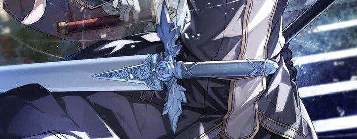

<div align="center">



# 🎸 Guitar


<p>
  
  
</p>

</div>

---

## About Me

```jsx
const about = {
  name: "Guitar",
  age: 18,
  role: "Fullstack Developer",
  stack: ["TypeScript", "React", "Next.js", "Node.js", "Python"],
  os: ["Windows 11", "Windows Server", "Arch Linux"],
  interests: ["Clean UI", "Graphic Design", "AI-assisted coding"],
  goal: "Fast, lightweight, good-looking software",
};

export default about;
```

---

## Tech Stack

<div align="center">

</div>

---

## GitHub Stats

<div align="center">


</div>

---

## Connect

<div align="center">

[](https://github.com/phumitchreal)
[](https://instagram.com/phumitch_real)
[](https://discord.com)

</div>

<p align="center">
  
</p>
